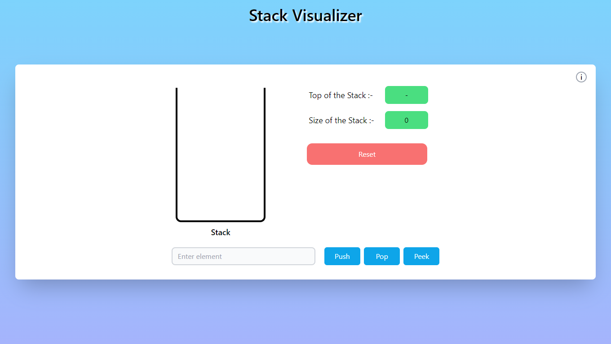
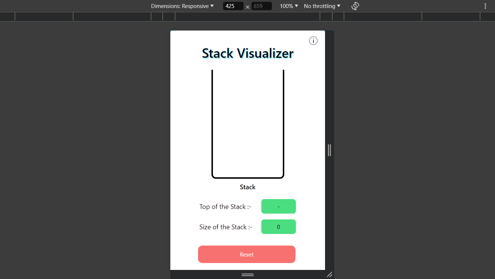

# Stack Visualizer

A web-based stack visualizer built using HTML, CSS, Tailwind, and JavaScript. This project provides an interactive interface to perform and visualize stack operations such as push, pop, peek, and check for emptiness.

## Live Demo

[Stack Visualizer](https://stack-visualizer-wheat.vercel.app/)

## Technologies Used

- HTML: For the structure of the web page.
- CSS & Tailwind: For styling and layout.
- JavaScript: For adding interactivity.

## Features

- Responsive UI: Designed with Tailwind CSS for a modern and responsive user interface.
- Push Operation: Add elements to the top of the stack.
- Pop Operation: Remove elements from the top of the stack.
- Peek Operation: View the top element of the stack without removing it.

## Project Screenshot

